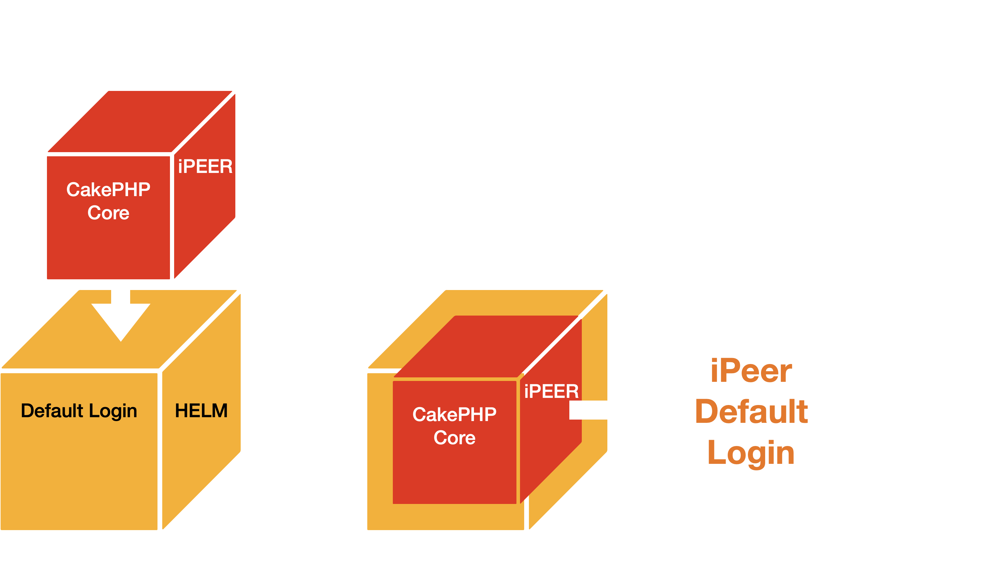
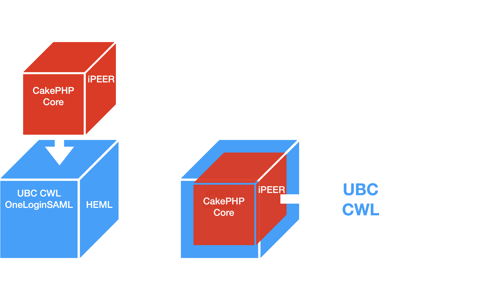

# iPEER Login Methods

### - The Defaul Login

This method relies on local database authentication, where users log in using a username and password stored within iPeer’s internal user table. This traditional login method is self-contained and does not require any integration with external systems or services.

iPeer CakePHP's ACL system using AROs and ACOs was a traditional method of handling access control before modern auth methods like SAML, OAuth2 became common.

### - The Auth Upgrade 

A Helm-powered upgrade for the iPeer authentication system that integrates UBC CWL and SAML-based UBC Identity Providers (IdP). This solution offers customizable Helm charts, values, and deployment templates, enabling UBC CWL login without modifying the original iPeer CakePHP codebase or altering its core functionality.

It also provides the flexibility to switch between the default login behavior and UBC CWL login—and vice versa—simply by adjusting the Helm chart configuration, without requiring changes to the application itself.

## Overview

This project provides:

-  Helm charts to wrap and deploy iPeer CakePHP ver 1.1.3
-  Seamless OneLogin SAML integration with UBC CWL 
-  Configurable `values.yaml`, `deployment.yaml` to manage environment-specific parameters
-  **🚀 ADVANCEMENT:** Deployment templates that extend OneLogin SAML with UBC CWL authentication while preserving the iPeer CakePHP app logic.

## Features

- Plug-and-play OneLogin SAML support, via Helm
- Externalized secrets and certs
- Clean separation of auth layer via Kubernetes
- **⚠️ IMPORTANT:** Zero modifications are made to the original iPeer CakePHP source code or its built-in Access Control List (ACL) system, which uses AROs (Access Request Objects) and ACOs (Access Control Objects) to manage permissions and access control.

