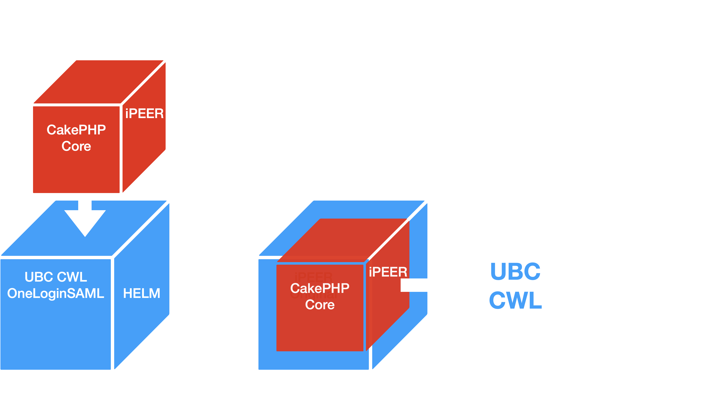

# iPEER Login Methods

### - The Defaul Login

This method relies on local database authentication, where users log in using a username and password stored within iPeer’s internal user table. This traditional login method is self-contained and does not require any integration with external systems or services.

iPeer CakePHP's ACL system using AROs and ACOs was a traditional method of handling access control before modern auth methods like SAML, OAuth2 became common.


-----------


### - The Auth Upgrade 

A Helm-powered upgrade for the iPeer authentication system that integrates UBC CWL and SAML-based UBC Identity Providers (IdP). This solution offers customizable Helm charts, values, and deployment templates, enabling UBC CWL login without modifying the original iPeer CakePHP codebase or altering its core functionality.




It also provides the flexibility to switch between the default login behavior and UBC CWL login—and vice versa—simply by adjusting the Helm chart configuration, without requiring changes to the application itself.


## Overview

This project provides:

-  Helm charts to wrap and deploy iPeer CakePHP ver 1.1.3
-  Seamless OneLogin SAML integration with UBC CWL 
-  Configurable `values.yaml`, `deployment.yaml` to manage environment-specific parameters
-  **🚀 ADVANCEMENT:** Deployment templates that extend OneLogin SAML with UBC CWL authentication while preserving the iPeer CakePHP app logic without the need of rebuild its image. 

## Features

- Plug-and-play SAML support using OneLogin, enabled through Helm deployment.

- Secrets and certificates managed securely via Vault, integrated with Helm values for clean and centralized secret handling.

- Clean separation of the authentication layer from the core iPeer application, maintained through Helm templates and charts.

- Helm-powered integration of UBC CWL authentication, seamlessly integrating and routing the login flow—without modifying the core iPeer CakePHP codebase.

⚠️ IMPORTANT: This solution makes zero modifications to the original iPeer CakePHP source code or its built-in Access Control List (ACL) system. The ACL continues to use AROs (Access Request Objects) and ACOs (Access Control Objects) to manage permissions and access control in a structured, hierarchical manner.

------------------

##  Quick Start

``` bash
git clone https://github.com/ubc/charts.git

```

### Modify flag for UBC CWL Login:

This introduces a configurable flag ubccwlsaml in the ipeer-stg-values.yaml file to switch between UBC CWL SAML login and the Default iPeer database login. By setting or removing this flag, admin can easily control the authentication method without modifying the iPeer image. 


```bash


vi ./ipeer-stg-values.yaml

# To enable UBC CWL login, set the `ubccwlsaml` flag:
#   Use: ipeer-stg-defaultlogin-values

# To use the default iPeer database login, either:
#   - Set the flag empty (`flag: `), or
#   - Remove the `flag: ubccwlsaml` flag entirely

# Apply the changes:
helm install/upgrade -n default -f ./ipeer-stg-values.yaml --atomic ipeer-stg ./charts/ipeer


```


### OneLogin SAML Integration for UBC CWL Authentication Login:

```bash

cd ipeer

helm install/upgrade -n default -f ./ipeer-stg-values.yaml --atomic ipeer-stg ./charts/ipeer
```

------------------

*Final Note: The iPeer CakePHP application's login method can be switched between the default (local database) login and UBC CWL SAML login using the appropriate Helm chart configuration—without rebuilding the application image and down-time. Each method is fully supported through dedicated Helm deployment templates and charts, allowing flexible authentication setup without altering the core CakePHP framework.*

